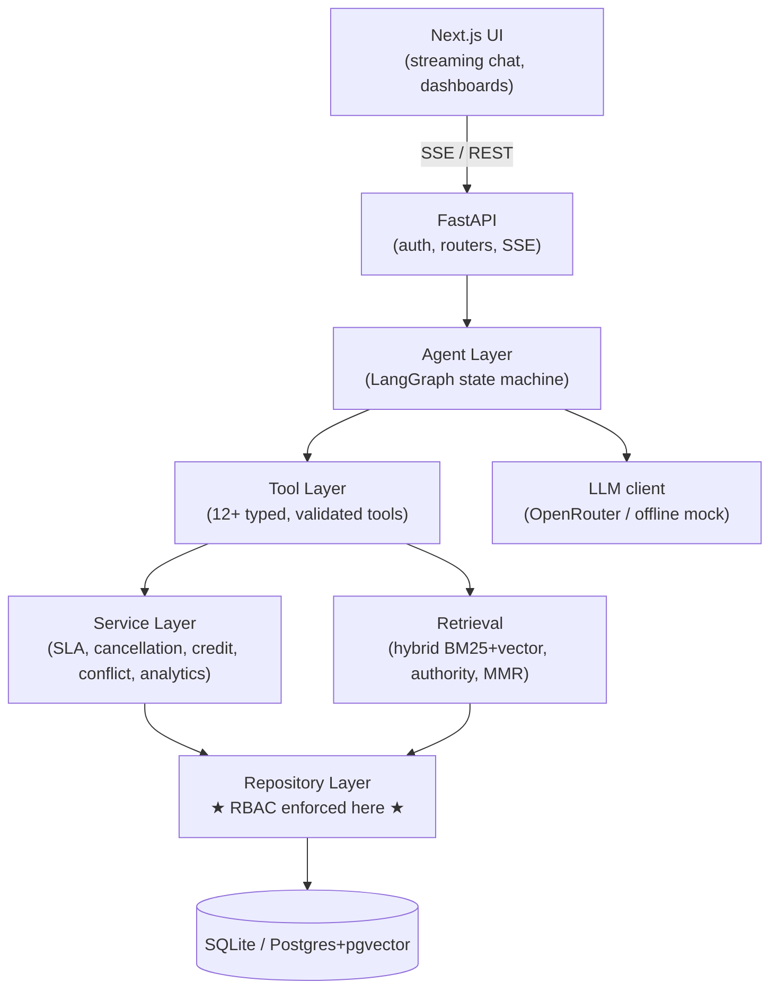
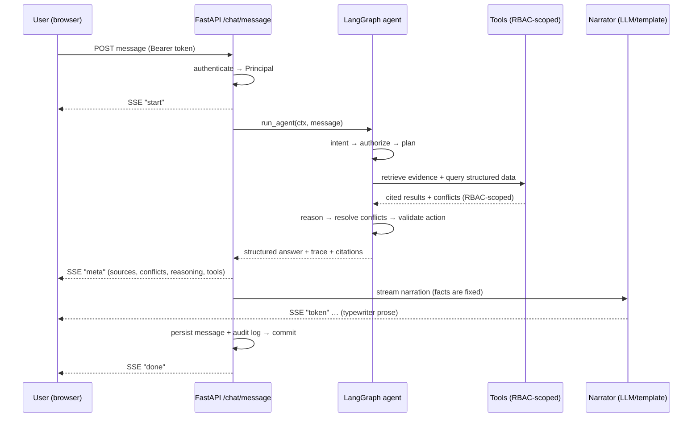
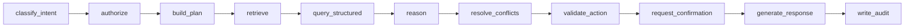

# ParcelPilot — Support Intelligence Platform

> An enterprise-grade **AI support platform** for ParcelPilot (a parcel-logistics SaaS). It answers
> customer and internal questions with **cited evidence**, resolves **conflicting policies by
> authority**, computes SLAs and eligibility **deterministically**, and takes **audited, confirmed
> actions** — with **role-based access enforced at the data layer**, not the prompt.

Built for the ParcelPilot AI Agent assessment, engineered to production standards: clean layered
architecture, a real **LangGraph** agent, hybrid **RAG**, strict **RBAC**, full observability, tests,
and a polished **Next.js** UI.

---

## Table of contents

- [Why this stands out](#why-this-stands-out)
- [The dataset & its engineered conflicts](#the-dataset--its-engineered-conflicts)
- [Architecture](#architecture)
- [The agent (LangGraph)](#the-agent-langgraph)
- [Source hierarchy & conflict handling](#source-hierarchy--conflict-handling)
- [Access control (RBAC)](#access-control-rbac)
- [Quickstart](#quickstart)
- [Demo script](#demo-script)
- [Assessment requirements → where they live](#assessment-requirements--where-they-live)
- [Tech stack](#tech-stack)
- [Testing](#testing)
- [Project structure](#project-structure)
- [Security](#security)
- [Roadmap & trade-offs](#roadmap--trade-offs)

---

## Why this stands out

| Principle | How it's realised |
|---|---|
| **The LLM never invents facts** | Every SLA target, fee, credit amount, and eligibility decision is computed by deterministic Python services. The LLM only *narrates* verified structured results. Hallucinated policy numbers are structurally impossible. |
| **RBAC lives in the data layer** | Access control is enforced in the **repository layer** by scoping every query to the caller's `Principal`. A customer cannot express a query that returns another account's rows — the SQL filter is added before the LLM ever sees data. |
| **Conflicts are explained, never hidden** | When sources disagree (e.g. a signed agreement vs. the current policy vs. a wrong historical ticket), the agent ranks them by authority, shows the disagreement, resolves it, and cites the winner. |
| **Actions are confirmed & audited** | State-changing tools are two-phase: `prepare → explain consequences → confirm → execute → audit-log`. Nothing mutates on the first turn. |
| **Runs with zero external dependencies** | Offline deterministic LLM + embedding fallbacks mean the whole platform runs, streams, and demos with **no API key and no Docker**. Add an OpenRouter key to upgrade prose quality. |
| **Everything is explainable** | Each answer ships a confidence score, a reasoning trace, a tool timeline, ranked citations, and conflict cards — all surfaced in the UI. |

---

## The dataset & its engineered conflicts

The platform is grounded in the **real assessment data pack** (6 policy/agreement PDFs + a workbook of
accounts, orders, and tickets). The reference "now" is the workbook snapshot: **`2026-08-16 11:00 IST`**
(a Sunday — so business-hours SLA math genuinely matters). Currency is **INR**.

These are the conflicts the system is built to handle correctly — each is a live demo:

| # | Scenario | The trap | Correct behaviour |
|---|---|---|---|
| 1 | **P1 SLA for Northstar (TKT-501)** | Deprecated policy says 1h, current policy says 30m | **Agreement wins: 15 min, 24×7 → BREACHED** (created 10:30, snapshot 11:00). Recommend escalation. |
| 2 | **Cancel ORD-1001 (Northstar)** | SOP + a historical ticket (TKT-450) say a ₹250 fee applies after 30 min | **Agreement waives the fee entirely → ₹0.** Historical ticket is context-only and wrong. |
| 3 | **Bulk upload failing (TKT-502)** | A historical ticket (TKT-451) says the limit is 3,000 rows | **Ops guide: limit is 5,000; KI-208 explains the ~3,000 failures.** Offer the workaround. |
| 4 | **Pickup shows BOOKED (TKT-504)** | Looks like a failed pickup | **KI-211: SwiftShip webhooks lag ≤20 min — verify before telling the customer it failed.** |
| 5 | **Service credit ORD-2002 (LumenWorks)** | SOP default is "lower of ₹500 or 10%", >2h threshold | **Agreement overrides: fixed ₹300, >4h threshold → eligible** (4h30m past window, carrier fault). |

Severity (P1/P2/P3) is **not** in the data — the agent classifies it from the description per the
current Support Policy (e.g. TKT-505 "API key exposure" → P1).

---

## Architecture

Clean layered architecture — each layer depends only on the one beneath it.



**Request flow for a chat turn:**



See [`docs/ARCHITECTURE.md`](docs/ARCHITECTURE.md) for the full breakdown.

---

## The agent (LangGraph)

Eleven single-responsibility nodes — a real state machine, not a linear RAG chain:



- **classify_intent / build_plan** — deterministic, auditable intent + a tool plan grouped into
  `retrieve` / `structured` / `action` phases.
- **retrieve** — hybrid RAG (`document_search`, `known_issue_match`).
- **query_structured** — RBAC-scoped lookups + the deterministic services (`sla_calculator`,
  `cancellation_evaluator`, `service_credit_evaluator`, …).
- **reason** — synthesises verified facts, computes confidence.
- **resolve_conflicts** — authority-ranked conflict resolution + escalation recommendation.
- **validate_action / request_confirmation** — prepares (never auto-runs) state changes.
- **write_audit** — records the decision, tools used, and outcome.

Prompt documentation and the full decision flow live in [`docs/AGENT.md`](docs/AGENT.md).

---

## Source hierarchy & conflict handling

Authority ranking (1 = most authoritative) drives every conflict resolution:

1. **Current Customer Agreement** → 2. **Current Policy** → 3. **SOP** →
4. **Operational Guide** → 5. **Structured Data** → 6. **Historical Tickets** → 7. **Deprecated Documents**

When sources disagree the agent **never silently picks one**: it lists each source with its authority
rank, states the resolution rule ("a signed agreement takes precedence per Support Policy §1"), shows
the resolved value, and recommends the safest action (escalating when a P1 SLA is breached or a fact is
unknown). Deprecated docs and historical tickets are retained for *context* and are visually struck
through in the UI.

---

## Access control (RBAC)

| Role | Data scope |
|---|---|
| **Customer** | Only their own account: orders, tickets, agreement. |
| **Support** | Only their assigned accounts. |
| **Manager** | All accounts + analytics + audit. |
| **Admin** | Everything + administration. |

Enforcement is in `app/repositories/` — every read is filtered by `Principal.accessible_account_ids()`.
Internal-only knowledge (ops guide, deprecated policy, historical tickets) is hidden from customers by an
independent audience filter. **No access decision depends on prompt text.**

---

## Quickstart

No Docker required. Two terminals.

**1) Backend (FastAPI, Python 3.11+)**

```bash
cd backend
python -m venv .venv
# Windows: .venv\Scripts\activate   |   macOS/Linux: source .venv/bin/activate
pip install -r requirements.txt
cp .env.example .env          # optional — runs offline with no key
python -m app.db.seed         # loads the real dataset + builds the knowledge base
uvicorn app.main:app --reload --port 8000
```

The API serves at `http://127.0.0.1:8000` (docs at `/docs`). It **auto-seeds** on first start if the DB
is empty, so the seed step is optional.

**2) Frontend (Next.js, Node 18+)**

```bash
cd frontend
npm install
npm run dev                   # http://localhost:3000  (proxies /api → :8000)
```

Open `http://localhost:3000`, pick an identity, and start chatting. Add an **OpenRouter** key to
`backend/.env` (`LLM_API_KEY=…`) to switch from the offline template to live LLM narration — the facts
are identical either way.

---

## Demo script

Sign in as **Maya (support)** and try, in order:

1. `What is the SLA on TKT-501 and is it breached?` → 15-min agreement SLA, **breached**, conflict card
   (agreement > policy > deprecated), escalation recommended.
2. `Escalate TKT-501` → a **confirmation card** with consequences → click **Confirm & execute** →
   escalation created + audit entry.
3. Switch to **Anjali (Northstar customer)**: `Can I cancel ORD-1001?` → **₹0, fee waived**, with the
   agreement-vs-SOP-vs-historical-ticket conflict resolved.
4. Switch to **Ravi (LumenWorks customer)**: `Am I eligible for a service credit on ORD-2002?` →
   **eligible, ₹300** (agreement override).
5. As Ravi, ask about **ORD-1001** (Northstar's order) → politely blocked (RBAC, no leak).
6. Visit **Operations** (internal) and **Analytics** (manager) for proactive insights and charts.

Full walkthrough with expected output: [`docs/DEMO_SCRIPT.md`](docs/DEMO_SCRIPT.md).

---

## Assessment requirements → where they live

| Requirement | Implementation |
|---|---|
| Natural-language chatbot | `frontend/src/app/(app)/chat` + `POST /api/chat/message` (SSE) |
| Document retrieval (RAG) | `app/retrieval/retriever.py` (hybrid BM25+vector, MMR, confidence) |
| Structured database queries | `app/tools/data_tools.py`, `app/repositories/` |
| Multiple tools | `app/tools/` — 13 registered tools |
| Multi-step reasoning | `app/agent/` LangGraph graph |
| State-changing actions | `app/tools/action_tools.py` (escalation, task, ticket update) |
| Confirmation before actions | Two-phase `prepare`/`commit` + `/chat/confirm` flow |
| Customer / internal roles | `app/core/security.py` (4 roles) |
| Proper access control | `app/repositories/` (data-layer RBAC) |
| Source hierarchy | `app/core/constants.py` (`SOURCE_AUTHORITY`) + services |
| Conflict handling | `app/services/*` + `conflict_service.py`, surfaced in UI |
| Escalation | `escalation_creator` tool + agent recommendation |
| Hosted architecture | FastAPI + Next.js, env-configurable, Postgres-ready |
| Modern UI | Next.js + Tailwind + Radix + Framer Motion + Recharts |
| Demo ready | Seeded real data, offline mock, one-command run |

Bonus features: AI insights & proactive detection, known-issue clustering, SLA countdowns, conflict
detection, confidence scoring, full audit + tool-execution observability, conversation history & pinning,
knowledge-base search, model fallback, cost-free offline mode, identity switching for RBAC demos.

---

## Tech stack

**Backend:** FastAPI · LangGraph · Pydantic v2 · SQLAlchemy 2 · SQLite (Postgres+pgvector-ready) ·
rank-bm25 + NumPy (hybrid retrieval) · httpx (OpenRouter) · structured JSON logging.

**Frontend:** Next.js 15 (App Router) · TypeScript (strict) · Tailwind CSS · Radix UI · Framer Motion ·
TanStack Query · Zustand · Recharts · Lucide.

---

## Testing

```bash
cd backend && pytest
```

36 tests across authorization (RBAC), services (severity/SLA/cancellation/credit), retrieval, tools
(validation + two-phase actions), and the end-to-end agent. Tests run against a throwaway DB seeded with
the real dataset.

---

## Project structure

```
parcelbot/
├── backend/
│   ├── app/
│   │   ├── api/           # FastAPI routers, auth, middleware, errors
│   │   ├── agent/         # LangGraph graph, nodes, intent, narrator, prompts
│   │   ├── tools/         # 13 typed tools + registry + safety wrapper
│   │   ├── services/      # deterministic business rules
│   │   ├── retrieval/     # hybrid retriever
│   │   ├── repositories/  # RBAC-enforced data access
│   │   ├── models/        # SQLAlchemy ORM
│   │   ├── ai/            # LLM client + embeddings
│   │   ├── db/            # engine, seed, policy + knowledge content
│   │   └── core/          # config, security, clock, constants, logging
│   ├── knowledge/source_pack/  # the original assessment PDFs + workbook
│   └── tests/
├── frontend/
│   └── src/{app,components,lib}/
└── docs/
```

---

## Security

Input & output validation (Pydantic), RBAC at the data layer, prompt-injection resistance (facts are
computed, not prompted), no cross-account data compilation, SQL-injection-safe (ORM), signed session
tokens, rate limiting, request-ID correlation, full audit logging, and contained errors (no stack traces
to clients).

---

## Roadmap & trade-offs

See [`docs/DECISIONS.md`](docs/DECISIONS.md). Highlights: SQLite is the local default with a documented
one-line switch to Postgres+pgvector; the offline embedder is swappable for a hosted embeddings endpoint;
Celery/Redis are designed-for but not required to run locally.
