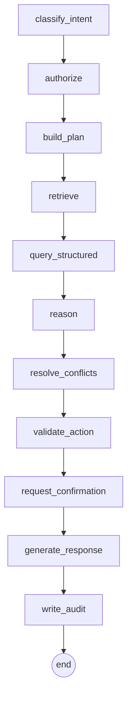

# The Agent — decision flow, prompts, and reasoning

The agent is a **LangGraph `StateGraph`** compiled once and invoked per turn (`app/agent/graph.py`). It
is deliberately a *state machine of small, auditable steps* rather than a single free-form LLM call — so
every decision is inspectable and reproducible.

## Node graph



| Node | Responsibility |
|---|---|
| `classify_intent` | Regex-extract entities (ORD/TKT/ACCT codes); classify intent (sla, cancellation, service_credit, triage, action_*, knowledge, greeting). If confirming a prepared action, short-circuit to commit. |
| `authorize` | Verify the `chat` permission; record the principal's data scope in the trace. |
| `build_plan` | Deterministically map (intent, entities, role) → an ordered list of tool calls in `retrieve` / `structured` / `action` phases. |
| `retrieve` | Run `document_search` (+ `known_issue_match`) — hybrid RAG, RBAC-scoped. |
| `query_structured` | Run lookups + deterministic services (`ticket_lookup`, `sla_calculator`, `cancellation_evaluator`, …). |
| `reason` | Extract verified facts into `key_facts`, build the answer draft, compute confidence. |
| `resolve_conflicts` | Merge conflicts from services + retrieval; recommend escalation on a breached P1 or unresolved uncertainty. |
| `validate_action` | For an action intent, `prepare` the state-changing tool (returns a proposed action, **no mutation**). For a confirmation turn, `commit` the pre-approved action + write audit. |
| `request_confirmation` | Flag that the response must ask for explicit approval. |
| `generate_response` | Finalise citations (dedupe, re-rank by authority), assemble the structured answer. |
| `write_audit` | Record intent, tools used, confidence, conflicts, and outcome. |

## Confidence scoring

- Deterministic computations (SLA, cancellation, credit, lookups) → **high confidence (≥ 0.82)** because
  the facts are computed, not guessed.
- Retrieval-only answers inherit the **retriever's confidence** (top score, margin, and support).
- Any "don't-promise-when-uncertain" signal (e.g. unknown carrier fault) **caps confidence at ~0.55**.
- Bucketed to LOW / MEDIUM / HIGH for the UI badge.

## Conflict-resolution algorithm

1. Collect conflicts from (a) structured services (each already knows its authority ranking) and (b) the
   retrieval-level `conflict_service` (current-vs-deprecated, authoritative-vs-historical).
2. Each conflict lists its sources with **authority rank** (1 = highest).
3. The resolution rule is stated explicitly ("a signed customer agreement takes precedence over the
   standard policy per Support Policy §1; deprecated docs and historical tickets are context only").
4. The winner (lowest rank, current status) sets the `resolved_value`.
5. If the resolved state is a breached P1 SLA or an unknown fact, escalation is recommended.

## The narration guardrail (prompt docs)

The LLM is only ever asked to **phrase verified facts**. The system prompt (`app/agent/prompts.py`) makes
this a hard contract:

```
You are ParcelPilot's AI Support Intelligence assistant.

Rules you MUST follow:
1. Use ONLY the VERIFIED FACTS and EVIDENCE provided below. Never invent or alter
   policy numbers, SLA targets, fees, credit amounts, dates, or eligibility.
2. Cite sources inline using their [S#] markers from the SOURCES list.
3. If sources conflict, explain the conflict briefly and state which source wins
   and why (a signed customer agreement outranks the current policy, which
   outranks deprecated documents; historical tickets are context only and may be
   wrong).
4. If an ACTION IS PENDING, do not claim it is done. Clearly summarise what will
   happen, list the consequences, and ask the user to confirm.
5. If confidence is low or a fact is unknown, say so plainly and recommend
   escalation rather than guessing.
6. Be concise, professional, and helpful. Respond in Markdown. Amounts are in INR.
```

The user message contains a JSON block of `verified_facts`, `conflicts` (with resolutions), the
`pending_action`, the retrieved evidence, and the `[S#]` sources map. Because the numbers originate in
code, **prompt injection cannot change a policy figure** — the worst a malicious document could do is add
noise to the retrieved evidence, which the authority ranking down-weights.

**Offline mode:** when no key is set, `narrator.compose_template` builds the same Markdown deterministically
from the identical structured answer — so the substance never depends on the LLM.
