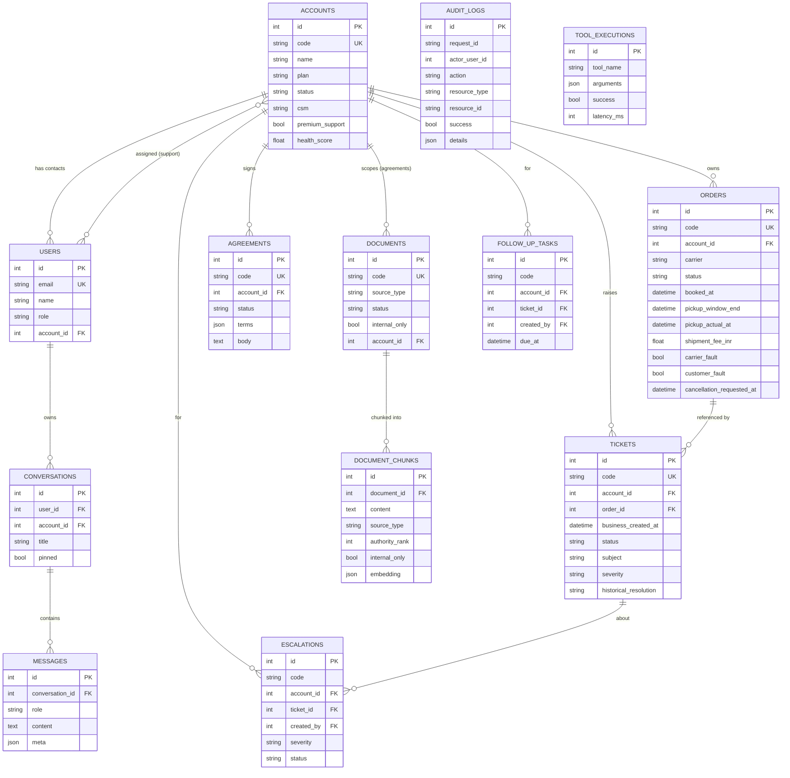

# Data model (ERD)

All tables are normalised; business identifiers (`ACCT-001`, `ORD-1001`, `TKT-501`) are kept as unique
`code` columns alongside integer surrogate keys used for foreign keys and RBAC scoping.

## Notes

- **`agreements.terms`** holds machine-readable overrides (SLA targets, cancellation waiver, service-credit
  threshold/amount/cap) that services read directly — the structured twin of the human-readable `body`,
  which is also chunked into the knowledge base.
- **`document_chunks`** denormalises `source_type`, `authority_rank`, `internal_only`, and `account_id`
  so the retriever can rank and RBAC-filter a candidate without extra joins. `embedding` is JSON locally
  and becomes a `pgvector` column in production.
- **`tickets.severity`** is nullable in principle — the source data omits it and the agent classifies it;
  the seed persists the classification for the dashboard.
- **`audit_logs`** is append-only in practice: every state-changing action writes one row, correlated by
  `request_id` to the tool-execution telemetry.
